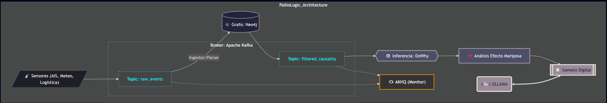

# PailioLogic 🦋

**PailioLogic** es un motor predictivo avanzado diseñado para identificar y mitigar el "Efecto Mariposa" en entornos marítimos. El sistema analiza cómo variables distantes y factores externos impactan en el flujo local de un puerto, detectando cuellos de botella antes de que se manifiesten físicamente. 

> **Nota:** Todo el sistema está diseñado para ejecutarse **100% dentro de Docker y de forma local**, garantizando la privacidad, la soberanía de los datos y la portabilidad del entorno.

## 🏗️ Arquitectura del Sistema

La arquitectura de PailioLogic se basa en la capacidad de conectar eventos globales con operaciones locales mediante un stack tecnológico de alto rendimiento y ejecución local orquestada por contenedores.

### Componentes Principales

| Componente | Función | Tecnología |
| :--- | :--- | :--- |
| **Ingesta** | Captura y orquestación de flujos de datos masivos. | Apache Kafka |
| **Observabilidad** | Monitorización y gestión de flujos de eventos en tiempo real. | **AKHQ** |
| **Relaciones** | Modelado de la red de causalidad y dependencias. | Neo4j (Graph DB) |
| **Inferencia** | Análisis de causalidad para distinguir causa de correlación. | Causal ML (`DoWhy`) |
| **Interfaz Inteligente** | Procesamiento de lenguaje natural y razonamiento local. | **Ollama** |
| **Gemelo Digital** | Simulación prospectiva y detección de anomalías. | Predictive Digital Twin |

---

## 🔄 Interconexión de la Arquitectura

1. **Capa de Ingesta (Kafka):** Absorbe eventos constantes (clima, cambios geopolíticos).
2. **Capa de Observación (AKHQ):** Interfaz visual para monitorizar los *topics* de Kafka (`raw_events` y `filtered_causality`), permitiendo la depuración del flujo de datos.
3. **Capa de Relaciones (Neo4j):** Mapea entidades (`[Buque]`, `[Atracadero]`, `[Factor Externo]`) para visualizar la propagación del impacto.
4. **Capa de Inteligencia Causal (DoWhy):** Valida el impacto real de un factor externo sobre el puerto local mediante el análisis del "Efecto Mariposa".
5. **Capa de Razonamiento Local (Ollama):** Actúa como el intérprete del sistema. **Ollama** procesa los hallazgos del motor causal y el estado del grafo para generar informes y permitir interactuar con el Gemelo Digital mediante lenguaje natural.
6. **Capa de Simulación:** Proyección final en el Gemelo Digital para la toma de decisiones.

---

## 🛠️ Stack Técnico & Despliegue
* **Orquestación:** Docker & Docker Compose
* **Lenguaje:** Python
* **Ingesta:** Apache Kafka (Modo KRaft)
* **Monitorización:** AKHQ
* **Base de Datos de Grafos:** Neo4j
* **Inferencia:** Microsoft `DoWhy`
* **LLM Local:** Ollama (Llama 3 / Mistral)

